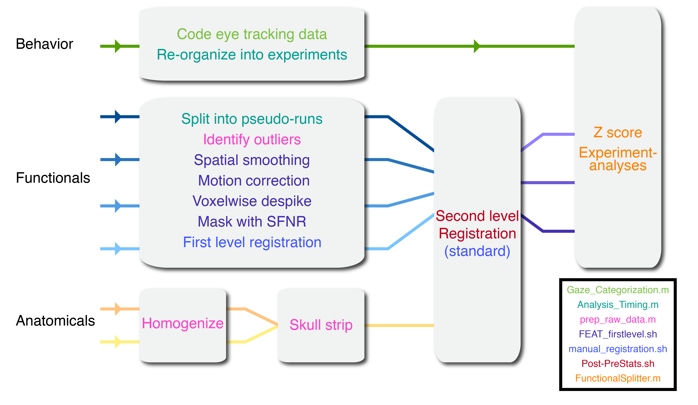

# Development project analysis pipeline
## V_1.2

Although substantial advances have been made in analyzing adult fMRI data using automated pipelines (e.g., HCP, fmriprep) these procedures typically do not work with infant fMRI data. Infants have small brains which mean that alignment to standard is difficult and they have different motion properties which means adult protocols for dealing with motion are inappropriate. Complicating this further, every session with an infant can be unique and thus without proper infrastructure will require extreme efforts in order to process them.

In this repository you will find the analysis pipeline used by the Turk-Browne lab for analyzing developmental fMRI data. This semi-automated pipeline allows users to preprocess task-based infant fMRI data in a robust and efficient way that minimizes the amount of manual intervention needed. This code is based on neuropipe and extended to meet the specific needs of developmental data. Below, you will find a schematic overview of the analysis pipeline. To analyze a participant's data so that it is ready for experiment-specific analyses only a few functions, based on the color steps coded in the schematic, must be run. However, throughout there are some manual steps and a lot of checks for quality assurance. For a more thorough description of the steps involved, review the 'Running a participant' subsection. For a visual walkthrough of the procedure, refer to 'infant\_neuropipe\_tutorial.pdf'

This pipeline assumes that data was collected using the code in the [experiment_menu](https://github.com/ntblab/experiment_menu) repository. It is recommended that you use that code base in order to set up your data to be used here. It is also a great way for you to collect data with a participant population that involves unpredictable stopping, starting and switching of different experiments. However, the most important hooks between these two repositories is that you are able to easily make timing files (the 'Analysis_Timing' script outlined in Step 11 used in this pipeline assumes a certain structure of the experiment data in order to extract timing information). If you could generate your own timing file information then you could avoid using the experiment\_menu system and still use this pipeline with some small tweaks.

Although this pipeline involves many manual steps, expert users can analyze a participant's dataset in approximately 2 hours. Compared some adult pipelines (e.g., fmriprep) this is long, however, dealing with the idiosyncratic nature of every infant session makes this a remarkably fast pipeline.

This code can and is used for analysis of adult fMRI data; however, that is mainly done for the sake of comparison to infants. Indeed, this pipeline is not optimized for the analysis of adult fMRI data but rather infant fMRI data. Parameters can be changed to adapt to whatever needs but note this background. Moreover, this code is adapted to the data formats of the [experiment_menu](https://github.com/ntblab/experiment_menu); a different data collection procedure will require different parameters.

Because of the nature of the data collection this repository was designed for, this repository will make one folder within which many experiments can be housed. This is not to say that you couldn't make a new copy of this directory for every project/experiment you run; however, in our use case of collecting infant data this is inappropriate because each participant potentially contributes to several experiments. Hence, this tool provides infrastructure to house all of these experiments under one roof with common code and resources.

## Expected background

This README and attached tutorial have been designed for intermediate to advanced fMRI users. In particular, it is expected that users will be familiar with bash, matlab and FSL. Indeed, throughout this repository there are many mentions to specific but commonly used scripts from these tools that will not be explained. It also helps to have completed the [neuropipe](https://github.com/ntblab/neuropipe) and [FSL](https://fsl.fmrib.ox.ac.uk/fslcourse/) tutorials.

Before starting to use the code in this repository it is recommended that you read through this README and then go through the [tutorial](https://github.com/ntblab/infant_neuropipe/infant_neuropipe_tutorial.pdf'). This tutorial is intended to repeat some of the content of the README but with supporting visual detail and additional considerations.

## Setting up

To use this repository, first clone this data to the folder you want to store it. It is expected that you will store and run this code from a cluster; although it might be possible to do this just on a workstation.

This repo is set up to handle a number of different cluster environments but to suit your specific cluster it is necessary to make some changes for the initial set up.

*Note:* $SUBJ_DIR refers to the full path to the subject folder which contains participant specific data, whereas $PROJ_DIR is the root directory containing the whole project. 

This repo has dependencies with FSL, FreeSurfer, AFNI, MATLAB, Python. [BrainIAK](https://github.com/brainiak/brainiak) is used for experiment-specific analyses but is not needed in the default pipeline. By default, these are loaded in as modules in the globals.sh script. To suit your cluster setup these should be changed and could be converted into something like a conda environment that you load in globals.sh.

In order to make the code here aware of where to find these dependencies, it is necessary for you to change the globals.sh file ($PROJ\_DIR/prototype/link/global.sh). This file sets up all of the necessary path names and software that will be needed for any function called in the pipeline within bash. If you need to access these paths from matlab, $SUBJ_DIR/scripts/read\_globals.m script pulls these paths. In `globals.sh`, near the top, is a section titled: "Things to change". In this, change all of the parameters so as to match what is appropriate for your cluster, environment and experiment. These lines may reference separate steps of the pipeline that are described below:  

Specify how to load in all of the dependencies listed above.
Change *PROJ_DIR* to the path to your repo, change *TR* to the appropriate default TR duration of your functional data (in seconds. The code can handle differences in TR across participant/run but just choose a good default value), and the *PACKAGES_DIR*. The *PACKAGES_DIR* contains various functions that are necessary for this repo but can't be included for copyright reasons. These include:  
[moutlier1](https://www.mathworks.com/matlabcentral/fileexchange/12252-moutlier1) - necessary for zipper detection in Step 5 (not enabled by default) 
[mrTools](http://gru.stanford.edu/doku.php/mrTools/download) - necessary for manual alignment in Step 13  
[NIfTI_tools](https://www.mathworks.com/matlabcentral/fileexchange/8797-tools-for-nifti-and-analyze-image) - necessary for loading in fMRI data for many steps  
[BIAC_Matlab_R2014a](https://wiki.biac.duke.edu/_media/biac:biac_matlab_06172014.tgz) - necessary to convert dicom files to nifti as part of Step 1 but could otherwise be skipped

Finally, this pipeline is dependent on data such as brain atlases. The *ATLAS_DIR* variable should point to a folder including these two datasets:

[nihpd_obj2_asym_nifti (Infant atlases)](http://nist.mni.mcgill.ca/?p=1005)  
[nihpd_asym_all_nifti (Child atlases)](http://nist.mni.mcgill.ca/?p=974)

## Analyzing a participant

This section describes describes what processing steps are performed on the anatomical and functional scans for the standard analysis pipeline of a single infant participant. The pipeline has been made to work flexibly with different parameters and can be adjusted to do more or less preprocessing as desired. Unless otherwise noted, all commands should be run within the subject folder ($SUBJ_DIR).  
You will note that there are some matlab and python scripts used in this pipeline. To be compatible with cluster use, almost all of these scripts have a bash wrapper script that allows it to be submitted to the cluster. For instance, '$SUBJ_DIR/scripts/prep_raw_data.m' is a matlab script that has a wrapper script called: '$SUBJ_DIR/scripts/run_prep_raw_data.sh'. There should be a 'run_$matlab-script'  for all of the scripts that ought to be run from the command line (i.e. scripts that aren't children of other scripts). These scripts set up the environment using globals.sh, hence why it is necessary to make the environment correctly.
As mentioned earlier, this code is set up for the specific-use case of analyzing infant data using the system the Turk-Browne lab has available. However, we believe that many of the tools we use here would be useful to others but require adaptation to suit their needs. We tried to write the code as general as possible to facilitate others adaptations but we couldn't be comprehensive. The hope is the following steps provide sufficient explanation of what needs to happen in order to know what you do and don't need to do. Moreover, each step includes instructions on how to skip it or otherwise create the necessary files so as not to diverge from the main pipeline.

1. Scaffold and retrieve data for a new participant using the initial NeuroPipe set up.
Scaffold, retrieve data and run `prep_xnat.sh` for a new participant, as described in the [neuropipe tutorial](https://github.com/ntblab/neuropipe-support). There are some differences in how this pipeline works compared to neuropipe but the most important concepts about neuropipe to understand are that for each new participant you 'scaffold' a new directory containing folders and files, some of which were directly 'copied' (so that changes are specific to that participant) and other files are 'linked' (so that changes affect all participants) and when you 're-scaffold' you add any new files that have been created for sharing but critically you DON'T overwrite any files that aren't linked.
	You should also move the matlab file that was generated by the experiment_menu code into the '$SUBJ\_DIR/data/Behavioral/' folder. 

    The prep_xnat.sh script creates the following naming structure: EPI=${SUBJ\_NAME}\_functionalXX.nii.gz, MPRAGE=${SUBJ\_NAME}\_mprageXX.nii.gz, PETRA=${SUBJ\_NAME}\_petraXX.nii.gz. If you have other scan types that you want to use then you can also store them but by default they won't be recognized. If they are anatomicals you would like to preprocess in Step 5 you can alter `scripts/run_prep_raw_data.sh` to recognize it.

    If you have an alternative procedure for converting data from the scanner into niftis then do the following: scaffold the new participant directory, create a '$SUBJ_DIR/data/nifti' folder and copy your nifti files into there. To make them readable by the scripts, rename your nifti files with the above naming structure. Make sure they have already been oriented to the correct space (presumably LAS). 

2. Add new participant information to the text file $PROJ\_DIR/scripts/Participant\_Data.txt  
Add the three columns of information to this file: matlab file prefix (the name of the matlab file that is generated by experiment menu), fMRI file prefix (which is the same as $SUBJ_NAME), and the participant age (in months). This script is necessary for group analyses (e.g. figuring out who is in what age range) and for the code to link the appropriate brain atlas to a participant for registration. For your first participant, you will need to create this file. 

    If you don't have differences in age that you care about, you still want to create this file because helper functions use this information.  
    
3. Mask the anatomicals to minimize influence from unwanted anatomical regions.  
View anatomical images and check for unwanted anatomical regions such as the shoulders or neck. The default viewing tool used in this pipeline is FSLview, but you could use FSLeyes, Freeview or any other tool. Create a box (in voxel coordinates) around the desired region (`fslmaths $Anatomical_unmasked -mul 0 -add 1 -roi $Xmin $Xlength $Ymin $Ylength $Zmin $Zlength 0 1 mask_01.nii.gz`) and then apply that mask to the anatomical (make sure to use quotes) (`fslmaths $Anatomical -mas mask_01.nii.gz ${Anatomical}_masked.nii.gz`). 

    If you don't want to do masking but you want to benefit from the preprocessing in Step 5 then you should just make a duplicate of your original file and call it ${Anatomical}\_masked.nii.gz. This naming is necessary for the code in Step 5 to identify which anatomical scans to further preprocess.

4. Prepare anatomicals for merging. 
If there are multiple anatomical scans that could be aggregated in order to clean them up/reduce noise then you can merge them to improve the scan quality. If you only have one anatomical, or you don't think there would be a benefit of aggregating multiple scans then skip this step. 

    To do this, register the masked anatomicals to the highest quality scan (`flirt -in $Low_quality_Scan -ref $High_quality_Scan -out ${Low_quality_Scan}_registered.nii.gz -dof 6`). Rename the high quality scan to have a '_registered' suffix (`cp $High_quality_Scan ${High_quality_Scan}_registered.nii.gz`)

5. Run prep\_raw\_data to perform several functions of preprocessing.  
Run the matlab script (`sbatch scripts/run_prep_raw_data.sh`) in order to do various preprocessing steps. Read this script in detail for more description of the preprocessing steps that were performed and how to change the default parameters used. This script determines the motion threshold for TR exclusions for the whole pipeline, as well as which time points will be used for registration. This script also does anatomical data cleaning (merging, unifizing, skull stripping) and gets the motion parameters. 

    If you only want to do a subset of steps in prep\_raw\_data you can specify them by providing different inputs to this function. For example: `sbatch $SUBJ_DIR/scripts/run_prep_raw_data.sh [7,8,9] 3 2 mahal_threshold 0` would run steps 7 through 9 on functional run 3, assuming the burn in amount was 2 TRs and setting the threshold for the zipper detection to zero, eliminating this piece from the analysis. Assuming this step was run before Feat_firstlevel.sh (Step 12) then these changes would percolate through the analysis.

6. Code the eye tracking data and add these files to behavioral data directory.  
In order to determine what functional data is usable, you might want to code the eyetracking data. This will help determine if there are TRs that may need to be excluded due to instances in which the participant was asleep or looking off-screen. Depending on the experiment, different types of gaze coding criteria can be specified. Scripts have been set up to code eye tracking data when collected using the experiment_menu code. The default is to assume that the eye tracking was collected via a frame grabber and thus needs to be manually coded. However, if EyeLink was used for data collection then eye tracking coding can be performed automatically using `$SUBJ_DIR/scripts/Gaze_Categorization_EyeLink.m`. 

    To code eye tracking data manually offline, there are scripts located in the Gaze\_Categorization folder found in this project directory ($PROJ_DIR/scripts/Gaze_Categorization). The coding of video frames is run via $PROJ_DIR/scripts/Gaze_Categorization/scripts/Gaze_Categorization.m. When the data has been coded offline, add the files stored in $PROJ_DIR/scripts/Gaze_Categorization/Coder_Files/ to the participant's appropriate behavioral data directory in $SUBJ_DIR/data/Behavioral/. To set up either of these approaches for gaze coding, you may need to edit the script found in this main directory: `$PROJ_DIR/scripts/Gaze_Categorization_Responses.m`. For more information, read the README: `$PROJ_DIR/scripts/Gaze_Categorization/README.md`.

    If you don't collect eye tracking data or don't code it then the code pipeline will still run and assume there are no exclusions due to eye tracking. That said, for some experiments like Posner, it will not produce any behavior related outputs or timing files.

7. Review the preprocessing of anatomicals and TRs identified as outliers.
There are several checks to do at this stage (after prep_raw_data has finished). First check that the anatomicals were preprocessed appropriately (e.g. that the merged brain is better than either brain individually). Then, review the TRs identified as outliers. In analysis/firstlevel/Confounds/Excluded_TRs_functional0\*.nii.gz the data is the same original functional data except that TRs tagged for exclusion have a white border added, meaning you can watch the video of the TRs in fslview and see which TRs are excluded on the fly. Moreover, analysis/firstlevel/Confounds/Excluded_TRs_functional0\*png contains the to-be-excluded TRs along with the preceding and following TRs. You can use firefox to view these (and other) png files.

8. Exclude runs as necessary.   
If a run shouldn't be included (e.g., there are excessive TRs excluded for motion, it was only a few TRs long, no data was collected, they moved out of the field of view) then create a file named Excluded_Runs in the participant's Confounds folder (nano $SUBJ_DIR/analysis/firstlevel/Confounds/Excluded_Runs) and fill it with the run numbers to be excluded (e.g. "1 2 4"). These runs will not contribute to the total TR number you have as a result of Post-PreStats (Step 14). Note that you may need to return to this step after running Analysis_Timing.m in step 11.

9. Edit the mat file if necessary.  
If there are errors in the mat file that need to be corrected (e.g. the code crashed halfway through an experiment and the TRs weren't collected, participant fell asleep but you didn't quit the block and you want to exclude it) then do so now. Copy the original mat file (cp $SUBJ_DIR/data/Behavioral/${{SUBJ_NAME}.mat $SUBJ_DIR/data/Behavioral/${SUBJ_NAME}\_Original.mat), then create a script that converts this data to have the desired properties. Save the new mat data as "$SUBJ_DIR/data/Behavioral/${{SUBJ_NAME}.mat". If you choose to edit the mat file, it is necessary that the Mat_Data.m script thoroughly describes what you changed so you can traceback any alterations.

    One kind of editing that is common is to remove triggers for runs that you may not want to include, potentially because they were calibration tests or were too short for use. Rather than having to exclude these TRs manually, you can create a file called $SUBJ_DIR/analysis/Behavioral/Analysis_Timing_TR_ignore.txt. In this, specify a time window (relative to the start of the menu) that you will exclude TRs between. This is a two-column file with each row as a window and the first column being the start (in seconds since experiment start) and the second column being the end (in seconds).

10. Create the FSF files.
Run $SUBJ_DIR/scripts/render-fsf-templates.sh. This makes assumptions about what the anatomical and standard reference will be: it assumes the anatomical will be '$SUBJ_DIR/data/$SUBJ_NAME_petra01.nii.gz' and the standard will be '$ATLAS_DIR/nihpd_obj2_asym_nifti/nihpd_asym_$AGE_RANGE_t1w.nii' ($AGE_RANGE is figured out using the information in $PROJ_DIR/scripts/Participant_Data.txt (Step 2). If you don't want to use these defaults you can supply the full path to the anatomical (first input) and standard (second input). For instance you may want to use the best anatomical image that you found when reviewing them (Step 7). 

    You can also provide a special suffix you want to save the name with (third input). For instance, if you want to generate a fsf file with a non-default smoothing parameter, you could provide '\_smoothing_thresh0' as the third input to `render-fsf-templates.sh` to create an fsf file with smoothing equal to 0. These names can also be strung together (e.g. '\_smoothing_thresh0_despiking1'). Finally, if you want to use a fsf file other than the default ($SUBJ_DIR/fsf/default.fsf.template) then you can provide this path instead. Different fsf files may have different parameters that can be changed and hence can allow for different types of feat analyses. 
    
    This step may be altered by the Analysis_Timing.m script (Step 11), specifically, if all of the blocks of a run are to be excluded then the run will also be excluded, and the fsf file will be renamed functional??_excluded_run.fsf

11. Create and check the timing files.  
A matlab script has been made (`$SUBJ_DIR/scripts/Analysis_Timing.m`) which will automatically generate timing files for both first and second level analyses. This is a very important script and so is thoroughly documented in the README for analysis_timing: `$SUBJ_DIR/scripts/Analysis_Timing_functions/README.md`. Check to ensure that the TRs per run printed in this script are the same as the number of TRs for the functional runs (which will include rest). More thorough checks should see if all the TRs per block make sense (how many are listed as burn in for example), whether the timing of blocks is as expected and whether the eye tracking data is being appropriately excluded. A rigorous check would also include checking that the time between block onsets stored in the log file of the experiment (typically signaled by 'Experiment beginning, time: XXX') corresponds to the block onset times in the timing files at first level.  

    If the experiment you are using is not already in the analysis pipeline, you will need to add it. Read the instructions carefully for how to add the experiment to the pipeline. This should probably be run in matlab GUI using a tunnel or interactive session.
    
    This script also deals with splitting data into pseudo-runs if more than one experiment is performed within a run. This will mean that new functional files are created and stored in `$SUBJ_DIR/analysis/firstlevel/pseudoruns/` and the fsf files created in step 10 for the runs containing the pseudoruns. This will create a run name with a letter appended to the run number (e.g., functional01a, functional01b). 
    
    Note: you can re-run Analysis_Timing any time you wish to generate new timing files; however, it must be run before FunctionalSplitter (Step 15) or else these timing files will not percolate to the experiment specific directory
    
    If you did not collect data using the [experiment_menu](https://github.com/ntblab/experiment_menu) code or your timing files are simple enough that you could generate them another way then you could skip this step (although in this case it is encouraged that you have alternative checks on your experiment timing then). 
    
    This code assumes it can accurately pull the participant's age from the timing file and use it to find an age appropriate standard. 

12. Run `FEAT_firstlevel.sh` on each functional run.   
To run FEAT, give the full path of the fsf file as an input into FEAT_firstlevel (e.g. `sbatch $SUBJ_DIR/scripts/FEAT_firstlevel.sh $SUBJ_DIR/analysis/firstlevel/functional01.fsf`). This will preprocess the data, doing smoothing, motion correction, detrending etc.; however, it does not perform any statistics. The preprocessed data will be passed on for subsequent analyses.

    Several steps are performed in this pipeline that are unique to infant scanning that may or may not be appropriate in your use case. The list is as follows:
    > From prep_raw_data (Step 5) the TR that minimizes the distance between all other TRs is selected used for motion correction and registration. This can be turned off by default by editing the default value of 'useCentroidTR' at the top of prep_raw_data. It can be turned off for a single subject by running `sbatch $SUBJ_DIR/scripts/run_prep_raw_data.sh [7,8,9] [1:100] $BURN_IN useCentroidTR 0` 
    >
    > TRs that are excluded are interpolated before you do detrending so that they have minimal effect on analyses. Turn this feature off by specifying a suffix ('\_interpolate0') as the third input to `$SUBJ_DIR/scripts/render-fsf-templates.sh`. 
    >
    > Use the SFNR values as the criteria for excluding brain and non-brain, rather than mean intensity. Turn this feature off by specifying a suffix ('\_sfnrmask0') as the third input to `$SUBJ_DIR/scripts/render-fsf-templates.sh`. 
    >
    > Despiking is performed using the AFNI tool 3dDespike to remove any outlier TR timepoints. Turn this feature off by specifying a suffix ('\_despiking0') as the third input to `$SUBJ_DIR/scripts/render-fsf-templates.sh`. 
    
    This script also integrates with `manual_registration.sh` such that if you are re-running a feat that already has been manually aligned (step 13), this will use that registration if it is still appropriate (i.e. if the reference TR has not changed).

    It is possible to turn off any of these parameters individually by using the above commands or editing the fsf file, but if all wish to be removed and 'normal' feat is desirable, you can simply pass the fsf file to `sbatch $SUBJ_DIR/scripts/run_feat.sh $fsf_file`. This will use the normal feat pipeline and ignore any additional specifications (e.g. for MELODIC)

13. Perform manual alignment for the functional volume to the anatomical.  
Look at the registration of the functional volume to high res, which was saved to the reg folder in the functional??.feat folder. The registration is likely to be bad with the non-optimal scans typical from awake infants. Improve the registration using the manual alignment function. To do the alignment for firstlevel, use the command: `./scripts/manual_registration.sh firstlevel_functional??`. Perchance your registration is good; if so, this step can be ignored. 
    
    This script will ask whether you want to make a new registration (using some default settings of FLIRT) or use the registration that has been previously created. The latter means you can run this script iteratively to gradually improve the fit. It also asks whether you want to also include another functional run's alignment as an alternative reference for registration, so as to make it easier to align all functionals to one another. Finally, it is also possible to use the transformation matrix from another run if you think two runs have the brain in a similar position and you have already 'fixed' one of those brains. This script includes many instructions you should follow, especially for your first time.
    
    The manual registration folder this script creates will be saved to $SUBJ_DIR/analysis/firstlevel/Manual_Reg/ when this is done. If/when `FEAT_firstlevel.sh` is run again, the manual registration you make may be used instead of the typical registration process if it is appropriate, meaning you don't have to do manual registration again. Note, this will only work if the example_funcs are the same across the two registrations; if they are different (e.g. you changed the motion threshold or the reference TR for instance) then you will need to do manual registration again.

14. Prepare first level functional data for second level.
Although your data has now been preprocessed within run, this pipeline aims to aggregate the data across runs and eventually to split it into separate 'runs' for the individual experiments. To start this, run `sbatch ./scripts/Post-PreStats.sh` to take first level functional data and create a second level space as if you collected all of your data in a single run. This involves many steps and in order to understand them you should thoroughly read the documentation of the script. The script takes all of the filtered functional data from the feat folders generated at the first level and then aligns them to the anatomical space (without up sampling the voxels). All of these functionals are then concatenated and masked appropriately. Finally, an attempt is made at aligning highres to standard and, by proxy, the functionals to standard.
    
    Note: The file that is passed on is the filtered_func_data, not res4d (the residuals of the filtered func after the design matrix is applied). This means your motion parameters can change when at this step without you having to redo the previous steps.

    This step is essential to allowing FunctionalSplitter (Step 15) to run. However, if you have a lot of data then this step may become unwieldy. Moreover, depending on how you want to do your analyses you might want to do second level analyses using FLAME or its ilk. In such cases, you probably don't want to run this script and will want to skip the next step (FunctionalSplitter). This being said, if you want to perform Steps 16-19 then you will need to create the ``$SUBJ\_DIR/analysis/secondlevel/registration.feat/`, potentially by just copying a feat folder from first level (although depending on your between run alignment, mileage may vary. To check, look at the masks made by FEAT_Univariate (step 17)

15. Split the runs according to timing files.  
Use `sbatch ./scripts/run_FunctionalSplitter.sh` to cleave the files such that each block, run and experiment are organized into NIFTI files. This also deals with balancing blocks between runs (when specified in code), zscoring runs and masking. To specify block balancing for a new experiment, you should create a script called: $SUBJ\_DIR/scripts/FunctionalSplitter\_functions/${ExperimentName}\_Block\_Balancing.m. 

16. Check the registration to highres and to standard, and make changes if necessary.  
The goal is to be able to convert from the concatenated space back to anatomical and standard space, so that you can map voxels onto the anatomical. `Post-PreStats.sh` should have generated a folder: $SUBJ\_DIR/analysis/secondlevel/registration.feat. In this folder the highres to standard alignment for the first functional run is used as the baseline (it doesn’t matter if this run is noisier because all runs should have the same highres to standard alignment). Also, the new example\_func2highres (trivial since they are already aligned) and example\_func2standard (which is the same transformation as the highres2standard) are created. You should review these registrations and proceed if they look good. However, if they fail (as is likely with infants) there are three options:  

    > If you think the issues are because of the standard brain (e.g., the standard isn't skull stripped and so your highres is the size of the skull, not the brain), use $SUBJ\_DIR/scripts/register\_secondlevel.sh $New_Standard to specify a new, appropriate standard
    >
    > If the issue is with the high res image, perform more skull stripping on the highres you are using, and then only run the second half of this code. For severe skullstripping I recommend using bet2 from FSL and vary the -g parameter.  
    >
    > If you choose to use manual alignment, run the script ./scripts/manual\_registration.sh secondlevel\_standard . Note that you will need to select "1" when prompted to make a new baseline, since this has not yet been created. However, once this is run you can reload the previously generated baseline and iteratively tweak alignment to improve the fit.

    If you needed to make these changes, once you have a good alignment to standard, you can then map your results into standard space using the appropriate registration: flirt -in analysis/secondlevel_${Experiment}/${AnalysisName}/${Functional} -applyxfm -init analysis/secondlevel/registration.feat/reg/example_func2standard.mat -out analysis/secondlevel_${Experiment}/${AnalysisName}/${Output} -ref analysis/secondlevel/registration.feat/reg/standard.nii.gz.

17. Run FEAT_univariate.sh  
This step creates a task versus rest contrast for each run ignoring the different conditions or experiment differences. This is an optional step but can be useful for interrogating your effect size for each run. It also will run `Analysis_DesignMotion` which produces images showing the correlation between the experiment design on each run and the motion parameters---very useful when motion may be task correlated. Once all the feats have been made at first level, run this command from the participant's directory: `sbatch $SUBJ\_DIR/scripts/FEAT\_univariate.sh`. Files such as Motion\_TaskCorrelation.png are outputted to: $SUBJ_DIR/analysis/firstlevel/Exploration/functional??_univariate.feat/.

18. Run run_FIR.sh  
Perform FIR analyses on the data from each run to observe the shape of the evoked response. The function run_FIR.sh handles all of the necessary steps of this analysis; all that is needed is that the univariate folders be created (by `FEAT_univariate.sh`). Run `sbatch $SUBJ_DIR/scripts/run_FIR.sh`. This will then create all of the FIR directories and summary results that are useful. To view the main ones, use: firefox analysis/firstlevel/Exploration/functional??\_fir.feat/Evoked_Response*.png. When you have run this on multiple participants with the same experiments, you can use `$PROJ_DIR/scripts/Aggregate_FIR.sh` to combine across participants

19. Review the participant.  
For each step listed above it is important to review the log files and outputs that are generated. To help with this, especially with lots of participants, the jupyter notebook found at `$SUBJ_DIR/analysis/participant_summary.ipynb` has functions for getting summary information for each run and behavioral information. For instance, there are functions to show your motion properties, how many blocks you have, what the registration looks like, gaze coding results etc. This can help point out if anything went wrong along the way and can be rerun at any time to see how changes affect the new version of the data. Note, that these functions assume that you have completed all of the previous steps.

    To open the notebook, one method involves running `$SUBJ_DIR/scripts/launch_jupyter.sh`. This creates a tunnel between your local computer and the cluster by generating a slurm job on a core which you can SSH on to from a different terminal window. You then point your browser to the localhost that was assigned to the tunnel. This is only one method of using jupyter notebooks and will likely require edits depending on your cluster set-up, if you have a different procedure then use that. 

20. Perform second level analyses.  
What you do here will depend on the experiment. For some experiments, it is typical to first perform 'statistics' in FEAT on the non-z scored data, then use this FEAT directory as a template for the Z score data (if you instead run FEAT on z scored data, the mask won't work because these volumes contain negative values and the masking function assumes all positive values). To run both the z scored and non z scored FEATs use: `scripts/Feat_stats.sh $Template_FEAT $Output_FEAT $Input_functional`. You may also use brainiak or other packages for conducting your higher level analyses.

## Adding to repository

User feedback and input is always welcome! Please give us feedback. If you find bugs then make an issue on Github explaining the bug and how to replicate it. 
If you have updates to the code you want to add then please follow the following steps:

On your private github account, fork this repo.  
Clone said forked repo: git clone https://github.com/$USER/infant_neuropipe.git  
Make your fork private if it isn't already. Do this on Github in settings  
Set your forked repos' upstream to the public: git remote add upstream https://github.com/ntblab/infant_neuropipe.git  
Make a branch for your update: git branch update_README  
Move into branch: git checkout update_README  
Add files to new branch  
Git add and commit files: git add README.md; git commit -m "Update README"  
Push changes to your branch: git push origin update_README  
On github, initiate a pull request  
Have the pull request reviewed  

## Contact us

If you have any questions or problems with the code the please reach out to us on [Gitter](https://gitter.im/infant_neuropipe/community). We are happy to help with bugs, questions and feature requests.

## License

This program is free software: you can redistribute it and/or modify it under the terms of the GNU General Public License as published by the Free Software Foundation, either version 3 of the License, or (at your option) any later version.

This program is distributed in the hope that it will be useful, but WITHOUT ANY WARRANTY; without even the implied warranty of MERCHANTABILITY or FITNESS FOR A PARTICULAR PURPOSE. See the GNU General Public License for more details.

You should have received a copy of the GNU General Public License along with this program. If not, see <http://www.gnu.org/licenses/>.
