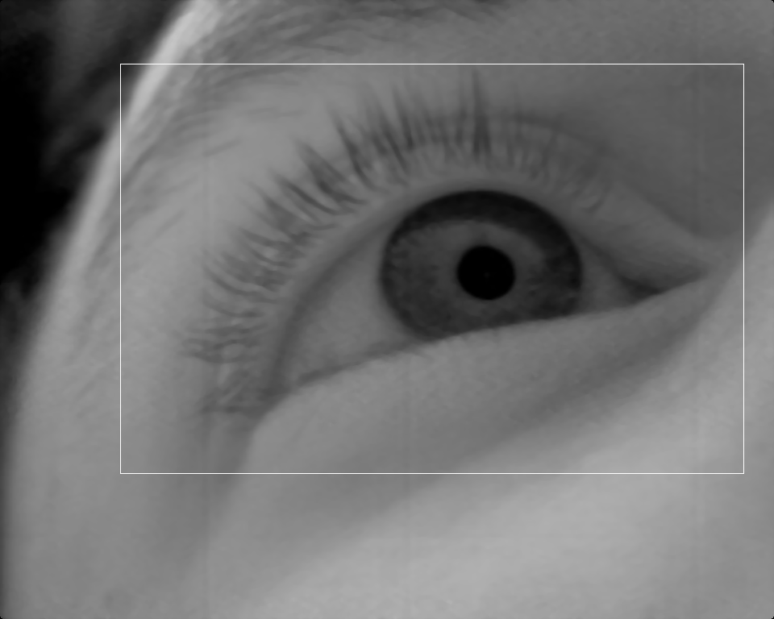
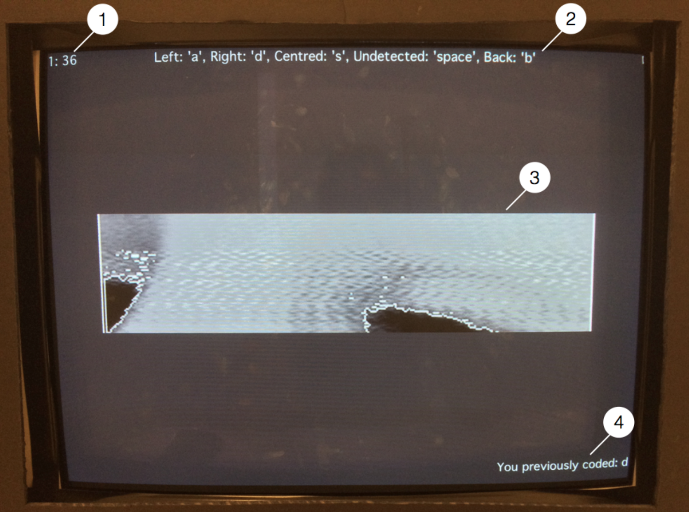

# Gaze coding overview

Your task is to categorize the fixation behavior of participants. You will be shown images recorded from participants and, to the best of your ability, you must report where you think participants are looking. For different parts of this task you will be asked to categorize the looking behavior using different labels, such as left vs. right or on screen vs. off screen. 

To help you with understanding what eye movements ‘look like’, you might be shown a demonstration of the participant looking to a given location. This is called an eye tracking calibration, which will show you an example of when a participant is looking at one location (i.e. to the center of the screen) and then moves their gaze to the side of the screen. This would represent an example of a look that you would categorize as a “left” look. It is important to note, that we are asking you to categorize leftward/rightward looks from your own perspective, and not that of the individual looking at the camera. Every participant’s gaze patterns are slightly different because their faces are positioned slightly differently relative to the camera in each task. Therefore, you should watch each participant’s eye tracking calibration to get a sense for their individual gaze behavior, even if you feel proficient at the task. You can re-watch these demos as many times as you like and every 20 or so trials you will have the opportunity to watch them as a refresher. However, some participants will not have eye tracking calibration. In this case, it may pay to code a few trials and then come back to them once you have a better idea.

When the eyes start moving it will be difficult to determine when to change the reported code. For instance, you might start coding as soon as a saccade to the left is initiated as 'left'. Conversely you might not code 'left' until the saccade is terminated. Ask your trainer for what to do on this but most importantly, be consistent.

Only a portion of the participants face will be shown to help you in this task. Press the up and down arrow keys at any time to shift this window. You should make sure that this window includes both eyes whenever possible and you are encouraged to move it whenever necessary.

If at any time you wish to quit, simply press ‘q’ and then follow the instructions. Your progress is saved after every trial.

It is important to stay focused while doing this task. If you need to take breaks, you can simply leave the program running or quit out. However, whenever you start back again, it is a good idea to re-watch a calibration as a refresher before continuing with your coding.

At any point, you can go back and re-categorize previous frames. Just press the ‘b’ key in order to go back. This option will come in handy often; since these are individual frames, it often helps to run back and forth between frames multiple times as if you were watching a movie. It will help you to detect movement better than just viewing each subsequent frame in succession. 

You can make the frames go by faster by pressing the 'p' key. For your first participant you are **strongly** discouraged from using this, but once you have gotten used to coding in general, you should turn this on.

After every trial ends, there will be a slight pause and it will update you as to what trial you just completed. You can still go back to a trial you have finished by pressing the 'b' key.

On particular trials, you could be asked to draw a box (click and drag with the mouse) where you think the eye is located. Draw this box so that it includes the eyelids (regardless of whether the eyes are open or not). Please be as precise as possible in drawing this box. If you mess up, you can press ‘r’ to draw it again, but do not go onto the next trial (by pressing ‘return’) until you think the box is appropriately placed around the location of the eye. The purpose of this is so we can collect data to train a machine learning classifier to detect and tell us where eyes are looking. You will be providing the data to train this classifier. See below for an example:

For some trials, instructions will appear on the bottom left corner of the screen. These instructions may provide hints as to what you are expected to do. For instance, if you see ‘Probably centre’, this means that we expect the gaze to be at the centre. The relevant discriminations are then centre versus undetected versus off-screen. However,  if you are confident they are not looking at the center, you should still report what you think they're doing. If this confusing, or if you have any questions then please ask your coding trainer.

After you have completed coding of a participant, your performance will be evaluated by several metrics. Review these metrics with your coding trainer to help you learn what to improve next time. There are a variety of possible metrics we can use to evaluate performance and these review sessions will be used to help you learn what to improve for next time. After you have completed several participants these review sessions will become more infrequent.

Response types:

Different response types are used for different trials; however, some are shared and some are not. You will never be asked to give a response where two could be simultaneously true (e.g., you won’t have the choice of ‘Left’ and ‘On-Screen’ at the same time). Here are some example coding responses:

Off-Screen: If the eyes are closed or they are clearly looking away from the screen (like looking down).  
Left: Their eyes are left of center  
Right: Their eyes are right of center  
Center: Their eyes are in the center  
Off-Center: Their eyes are off center (either left, right, up or down but still on the screen)  
On-Screen/present: Their eyes are on screen somewhere, either centre, left, right, up or down but still on screen  
Undetected: The eyes cannot be detected because they are occluded (e.g., the infant covers the camera with their hand) or because you have no idea where there eye is (can happen in the dark). This should be used rarely, it **IS NOT** used when they are not looking at the screen. Note if you know they are not in the bore, this is not undetected but off-screen.

Start up:

Log onto the eye tracking computer  
Open Matlab  
Change directory: cd $PROJ_DIR/scripts/Gaze_Categorization/scripts/  
Run the following command: Gaze_Categorization(‘XX’, ‘YY’), where XX refers to your coder ID and YY refers to the participant ID to be coded  
Follow the instructions  

Strategy:

Coding can be very difficult to do well. It is hard to know what is an acceptable degree of eye movement in order for it to fit into a certain category. It is because of this ambiguity that you must remain focused and, critically, consistent. If a certain degree of eye movement was sufficient for a saccade in one direction, that same degree of movement should be sufficient for categorization in the other direction.

Depending on your camera and focus, there may be a lot of noise in the images: sometimes they will be blurred, sometimes static will occlude the eyes, sometimes the eyes will be in the shadow. It is critical to the success of this task that you judge a fixation in the context of the other fixations adjacent in time to it. Sometimes you will see an image and ask yourself: Is that the eye? Or other times, is the eye open or closed? In these cases, you are encouraged to advance the slides (best practice is to use the ‘Undetected’ key) until you can see where the eye is and then go backwards (to the point where you had your first ‘Undetected’ response) and respond according to the assumed location. This will also hopefully tell you whether the eyes, as you were originally seeing it, was actually off-screen (e.g. you see the eyes were actually closed).

It is critical that you are precise about your responses. This will mean going slowly and backtracking a lot. For instance, the eye might be looking leftward, while you are holding down the left key to advance. In the space of a single frame they might shift to rightward looking. It is critical that you backtrack to the exact frame where they transitioned from looking to the left to now looking at the right (and label it appropriately).

Try to minimize ‘Undetected’ responses. It is generally uninformative for you to report that the eyes were undetected, so even if you are not certain about your judgment you should give your best guess. Only resort to ‘undetected’ when you are confident the eyes are not visible.

Interface:
 
 Here is an example of what the display will look like:  
1. Counter: The first number represents the trial you are up to, the second represents the frame you are on.  
2. Relevant key presses: Only these key presses will be accepted (with ‘q’ for quit and 'p' for toggling speed also available). Remember that these will vary depending on the phase of the experiment.  
3. Image of participant: In the example it is slightly too high and should be shifted down to include the participant’s eyes. The image is also low quality.  
4. If you go back, this will show what response you previously provided when presented with this frame.  

Evaluation:

Your performance will be evaluated in two ways: 

For the trials in which the type of eye movement is known, we will determine how well your responses map onto where the participant should have looked.  
For all, the consistency of your responses with other coders will be evaluated.  

Once you have finished reading this and understand it, talk to the coding trainer to get started! 
